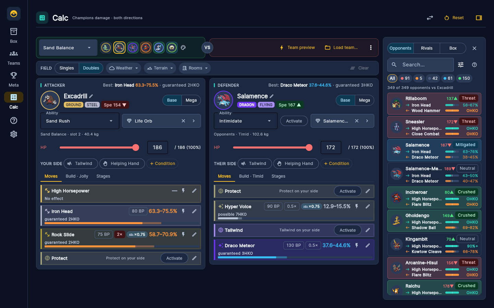
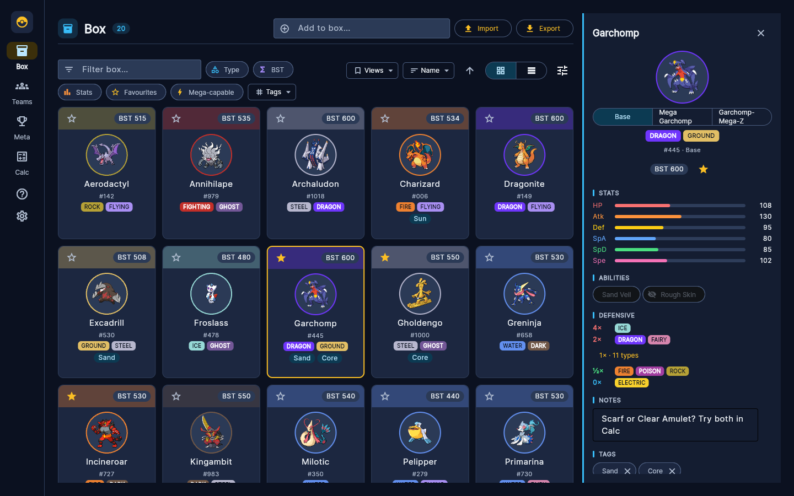
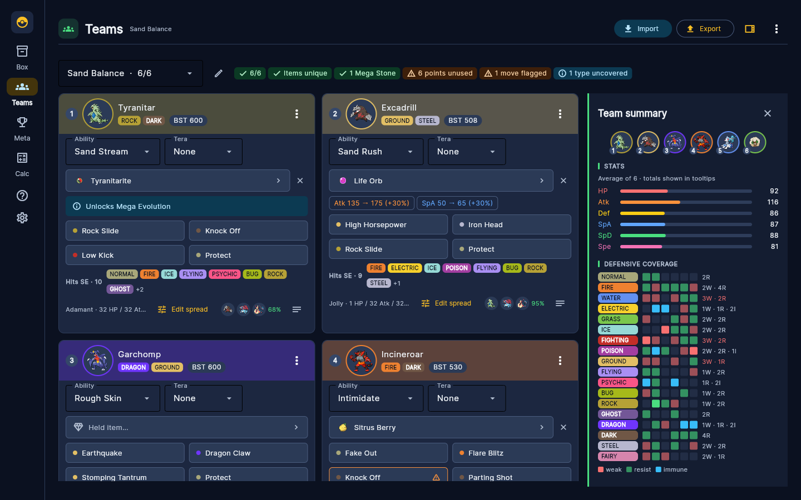
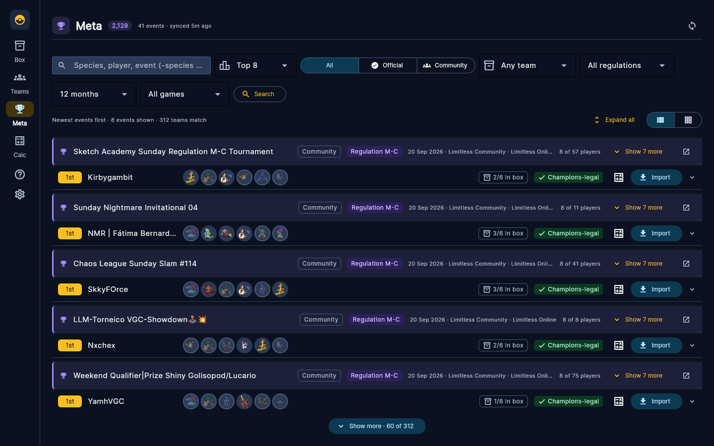

# Champions MetaDesk Studio

**A desktop and web workbench for competitive Pokémon Champions (VGC) players: your box, your
teams, the live tournament meta and a two-way damage calculator in one app.**

[](https://github.com/JsNcAr/champions-metadesk-studio/actions/workflows/ci.yml)
[](https://github.com/JsNcAr/champions-metadesk-studio/releases/latest)
[](LICENSE)




Champions MetaDesk Studio keeps a player's roster, builds and meta research in one place.
Add the Pokémon you own, build teams with Champions' stat-point spreads and item rules, browse
real tournament teams from Limitless and Victory Road, and see how any matchup plays out in
both directions. It is written in Python with [Flet](https://flet.dev) (Flutter) for the UI and
SQLite for storage, runs as a native desktop app or in the browser, and ships as standalone
executables for Windows, macOS and Linux.

*Unofficial fan-made tool: not affiliated with Nintendo, Game Freak, Creatures Inc. or The
Pokémon Company ([details](#license-and-disclaimer)).*

## How it's verified

- **The damage engine is checked against the reference.** `domain/damage/` is a Python port of
  the Pokémon Champions module of Smogon's damage calculator, and it is replayed against
  **997 golden scenarios** generated by running the original calculator: every roll and every
  KO text must match ([fixtures](scripts/damage_fixtures/)).
- **636 automated tests** cover the domain rules, repositories, services and the UI. UI tests
  drive the views headlessly and push every control through Flet's real diff and serialisation
  path. A layout lint rejects control shapes that Flutter would refuse at runtime, such as an
  expanding child inside a wrapping row or one control placed in two parents.
- **CI on every push and pull request** runs the suite (failing on any leaked database
  connection), a lint for real errors, and a smoke test that builds all five views. The release
  workflow runs the same tests again and checks the tag against the version before it builds
  anything ([releasing](docs/releasing.md)).
- **Performance is measured, not assumed.** Query and rendering work was profiled against a
  year-scale synthetic database (1,200 tournaments, 66,000 teams) and verified in headless
  Chromium against the running app ([architecture](docs/architecture.md#rendering-performance),
  [testing strategy](docs/testing-strategy.md)).

## Features

| Box | Teams | Meta |
|---|---|---|
|  |  |  |

- **Box.** Add Pokémon by name (forms and Megas normalised), filter by type, stats, tags,
  favourites and Mega capability, and import or export the whole box as JSON, a names list or
  CSV.
- **Teams.** The whole team at a glance in six compact cards; one click opens a slot's editor
  in place: forms, abilities, items with Champions legality guardrails and stat deltas, legal
  moves ranked by tournament usage, and the Champions stat-point spread (0–32 per stat, 66 in
  total). An analysis panel covers health checks, level-50 stats and speed order, defensive
  and offensive coverage, and the team's roles (speed control, Fake Out, Intimidate…).
  A library shows every team with its six Pokémon, searchable and sorted by last edit.
  Showdown and Poképaste import and export. Each team is built
  for a **format** that decides which mechanics it shows: Champions has Mega Evolution, and
  custom formats (Settings) can switch on Terastallization.
- **Meta.** Tournament teams synced in the background from Limitless and Victory Road, grouped
  by event, filterable by species, player, regulation, placement and how many of the members
  you already own. Any team imports into the builder in one click.
- **Calc.** Both directions at once, with each side's best hit and who moves first always in
  view. It covers the field (weather, terrain, rooms, screens, hazards and more), stat stages,
  statuses and critical hits, and classifies every Champions species against your attacker
  (Crushed, Threat, Wall, Mitigated, Neutral) using their most-used tournament sets. Turned
  around, it colours your own team by how each member fares against the rival you are
  checking. **Rival teams** keep presets to plan against (saved from Meta, your own teams, a
  paste or a Poképaste link) and the team you are facing now: enter the six species at team
  preview or load a preset into the battle, and each rival is one click from the Defender
  panel, keeps what the battle reveals, and shows up in a Team vs team grid of every pairing.

## Download

Standalone builds for Windows, macOS and Linux are attached to every
[release](https://github.com/JsNcAr/champions-metadesk-studio/releases/latest). No Python
needed. Release notes are in the [changelog](CHANGELOG.md).

## Run from source

Requires Python 3.13 and [Poetry](https://python-poetry.org).

```bash
poetry install
poetry run champions-metadesk          # desktop app
poetry run champions-metadesk --web    # in the browser, at http://localhost:8550
poetry run champions-metadesk --cli    # interactive terminal shell
```

`metadesk` is a shorter alias, and `poetry run python -m pokemon_champions_planning_tool.main`
does the same with the same flags. On first launch the app downloads the Pokédex data and
starts syncing tournaments in the background; press **F1** in the app for keyboard shortcuts
and tips.

### Configuration

| Variable | Default | Purpose |
|---|---|---|
| `PCPT_DATABASE` | `pokemon_champions.db` (working directory) | Path of the SQLite database file. |
| `PCPT_PREFERENCES` | `preferences.json` beside the database | Path of the view-preferences file. |
| `PCPT_VR_MAX_PLACEMENT` | `64` | Placements ingested per official event from Victory Road. |
| `PCPT_ASSETS_DIR` | `assets` (working directory) | Directory the app serves static assets from. |
| `PCPT_SPRITE_CACHE_DIR` | `sprites` inside the assets directory | Where downloaded sprites are cached. Keep it inside the assets directory. |

Box exports go to `pokemon_team_stats.csv`: the CLI keeps it in sync with the box, and the GUI
writes it when you export.

## Development

```bash
poetry run python -m unittest discover -s tests       # the test suite
poetry run python scripts/make_demo_db.py             # a demo database with real data (network)
poetry run python scripts/release.py prepare patch    # cut a release (see docs/releasing.md)
```

Documentation:

- [Architecture](docs/architecture.md): layers, the UI package, view switching and rendering rules
- [Data model](docs/data-model.md) and [integrations](docs/integrations.md) (PokéAPI, Showdown,
  Limitless, Victory Road)
- [Testing strategy](docs/testing-strategy.md)
- [Building executables](docs/building.md) and [releasing](docs/releasing.md)
- [Roadmap](docs/roadmap.md) and [changelog](CHANGELOG.md)

Repository layout:

```text
src/pokemon_champions_planning_tool/
    main.py            entry point (desktop / --web / --cli)
    domain/            Pokémon identity, stat points, type chart, the damage engine
    infrastructure/    SQLite models and repositories; PokéAPI, Showdown, Limitless and Victory Road clients
    services/          imports, tournament sync, damage calculation, sprite cache
    ui/                Flet app: shell, Box, Teams, Meta, Calc and Settings views, components, theme
tests/                 unit, repository, service and UI tests; damage fixtures
scripts/               release, demo database, UI smoke test, damage fixture generator
docs/                  architecture, data model, integrations, building, releasing, testing, roadmap
```

## License and disclaimer

The code is released under the [MIT License](LICENSE). The damage engine is a port of Smogon's
MIT-licensed calculator, and the data comes from Pokémon Showdown, PokéAPI, Limitless and
Victory Road; see [NOTICE.md](NOTICE.md) for their notices and credits.

Champions MetaDesk Studio is an unofficial fan-made tool. It is not affiliated with, endorsed or
sponsored by Nintendo, Game Freak, Creatures Inc. or The Pokémon Company. Pokémon and Pokémon
character names are trademarks of their respective owners. No sprites or artwork are
distributed with this project; they are loaded at runtime from Pokémon Showdown.
