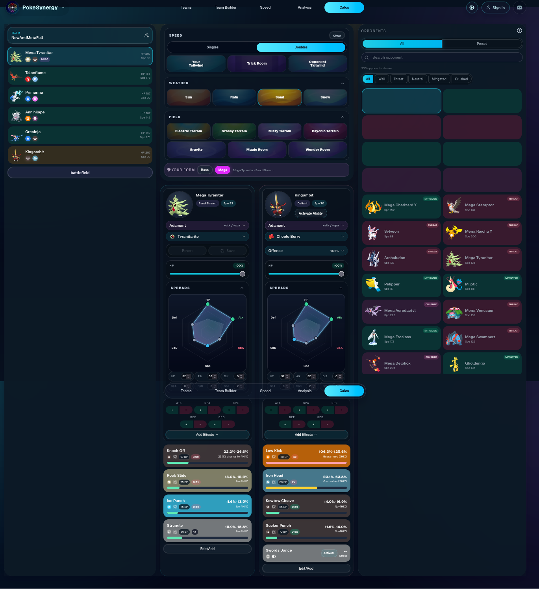

# Design references

## Calc view: PokeSynergy

`pokesynergy-reference.png` is a screenshot of the damage calculator on **PokeSynergy**, a
separate, third-party Pokémon team-building site. It is not part of this project. It was the
layout reference when the Calc view was redesigned (commit `25fe1e5`): a team rail on the left,
field tiles over the attacker and defender panels, type-coloured move cards carrying the
damage, and an opponents list classifying every species against the attacker.

The implementation, visual design and wording in this repository are original; the screenshot
is kept only to credit the inspiration. All rights to PokeSynergy's design belong to its
authors.
